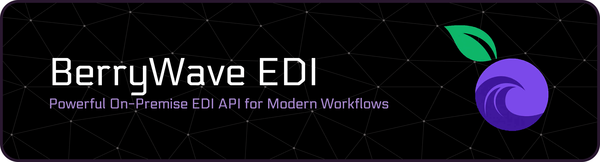

[Quick Start](#quick-start) | [Features](#key-features) | [Community vs Enterprise](#community-and-enterprise-editions)

BerryWave Software delivers a robust REST API that brings enterprise-grade EDI processing directly into your environment — no cloud uploads, no data exposure, no limits.

🌐 **Website:** [https://www.berrywave-edi.com/](https://www.berrywave-edi.com/)

---

### Seamless EDI Integration

Easily integrate with your existing orchestration or automation tools to handle complex EDI workflows for X12 and EDIFACT standards.

### Key Features

* **Bi-Directional Conversion:** Convert EDI to JSON or XML — and back again
* **Document Splitting:** Split multi-transaction EDI files into individual documents
* **Compliance & Validation:** Validate syntax and detect compliance errors efficiently
* **Automated Acknowledgments:** Generate 997, 999, and CONTRL acknowledgments seamlessly

### Proven in Production

While the API is new, the core EDI engine powering it has driven mission-critical operations across:

* **Healthcare** (Claims, Payments, Eligibility)
* **Retail & Supply Chain** (Purchase Orders, Invoices, Ship Notices)
* **Finance & Logistics**

### On-Premise. Secure. Scalable.

* **Simple Setup:** Quick, one-step execution on Linux, Windows, or macOS
* **Zero Bloat:** Requires only a standard Java JRE — no external DB or messaging dependencies
* **Data Ownership:** Keeps sensitive EDI data strictly inside your firewall
* **High Throughput:** Eliminates cloud network latency and large payload transfers
* **Scalable:** Built to handle high-volume enterprise workloads

---

### Community and Enterprise Editions

The API for EDI is available both as a **Community Edition** (freely available for commercial use) and a full-featured **Enterprise Edition** licensed by BerryWave Software.

|                     | Feature                                                                                               | Community Edition | Enterprise Edition |
|:--------------------|:------------------------------------------------------------------------------------------------------|:-----------------:|:------------------:|
| **EDI Standards**   | X12                                                                                                   |         ✅         |         ✅          |
|                     | EDIFACT                                                                                               |         ✅         |         ✅          |
|                     | HL7 v2.x                                                                                              |         ❌         |         ✅          |
|                     | TRADACOMS                                                                                             |         ❌         |         ✅          |
| **EDI → JSON**      | Convert without loss of EDI data                                                                      |         ✅         |         ✅          |
|                     | Human-readable indented JSON or compact JSON output                                                   |         ✅         |         ✅          |
|                     | Represent segment loops in JSON                                                                       |        ✅†         |         ✅          |
|                     | Alternate JSON representations                                                                        |         ❌         |         ✅          |
| **JSON → EDI**      | Produce EDI from JSON (reverse of EDI → JSON)                                                         |         ❌         |         ✅          |
| **EDI ↔ XML**       | Analogous to JSON support                                                                             |         ❌         |         ✅          |
| **Healthcare**      | Create 277 Claim Acknowledgments from 837 Claims, accepting all claims                                |         ✅         |         ✅          |
|                     | Create 277 Claim Acknowledgments from 837 Claims, using accept/reject details in JSON                 |         ❌         |         ✅          |
|                     | Create 835 Payment Advice from 837 Claims using payment details in JSON                               |         ❌         |         ✅          |
| **Supply Chain**    | Create 855 Purchase Order Acknowledgment from 850 Purchase Order, accepting all items                 |         ✅         |         ✅          |
|                     | Create 855 Purchase Order Acknowledgment from 850 Purchase Order, using accept/reject details in JSON |         ❌         |         ✅          |
|                     | Create 856 Ship Notice from 850 Purchase Order, using shipping details in JSON                        |         ❌         |         ✅          |
|                     | Create 824 Application Advice from 810 Invoice, confirming acceptance                                 |         ❌         |         ✅          |
|                     | Create 824 Application Advice from 810 Invoice, using accept/reject details in JSON                   |         ❌         |         ✅          |
| **Acknowledge EDI** | Generate standards-based EDI acknowledgments (997/999/CONTRL)                                         |         ✅         |         ✅          |
| **Validate EDI**    | Detailed syntax and compliance validation                                                             |         ❌         |         ✅          |
|                     | Compliance errors reflected in 997/999/CONTRL                                                         |         ❌         |         ✅          |
|                     | Compliance report                                                                                     |         ❌         |         ✅          |
| **Split EDI**       | Split multi-transactional EDI into a series of single-transaction EDI files                           |         ❌         |         ✅          |

> † *Community Edition supports segment loop representation for selected document types: 837P Healthcare Claims (v005010) and 850 Purchase Orders (v004010, 004030, 004060, 005010).*

---

## Quick Start

### 1. Download the Executable

Download the latest runnable `.jar` file from the [Releases](https://github.com/RBMayberry/BerryWave-EDI-API/releases) section (e.g., `berrywave.api-1.1.6.jar`). You can verify its integrity using the provided SHA-256 checksum.

### 2. Run the Application

The application can be started from the command line as shown, and of course started in a script suitable for your platform and environment.
Java 21+ is the only pre-requisite. 

```sh
java --version
java -jar berrywave.api-1.1.6.jar
```


### 3. Configuring the Port
   On startup, the application creates a default application.yml file in the current directory listening on port 8080. To use a custom port, modify application.yml.

### 4. Quick Example: EDI to JSON Translation

Once the service is running, open a new terminal window and run this command to convert an inline 850 Purchase Order into JSON:

```bash
curl -X POST "http://localhost:8080/berrywave/v1/transformFromEdi" \
  -H "Content-Type: application/edi" \
  --data-binary @- << 'EOF'
ISA*00*          *00*          *ZZ*SENDERID       *ZZ*RECEIVERID     *230501*0930*U*00401*000000001*0*P*>
GS*PO*SENDERID*RECEIVERID*20230501*0930*1*X*004010
ST*850*0001
BEG*00*SA*PO1234567**20230501*610385388
CUR*BY*USD
REF*DP*120
ITD*14*3*2**45**46
DTM*001*20230510
N1*BY*Buyer Company*9*123456789
N3*100 Main Street
N4*Anytown*CA*90210
N1*ST*Supplier Company*9*987654321
N3*500 Industrial Park
N4*Othertown*TX*75001
PO1*1*100*EA*12.75*CB*12345-01*MG*AcmeWidget
PID*F****Acme Widget Model A
QTY*21*100
DTM*002*20230515
CTT*1
SE*18*0001
GE*1*1
IEA*1*000000001
EOF
```

### 5. Home Page & Swagger Docs
http://localhost:8080/berrywave/v1

http://localhost:8080/berrywave/v1/api

### 6. Postman Collection
   Import the pre-configured Postman collection located in the /postman directory to immediately test API endpoints against sample EDI data.